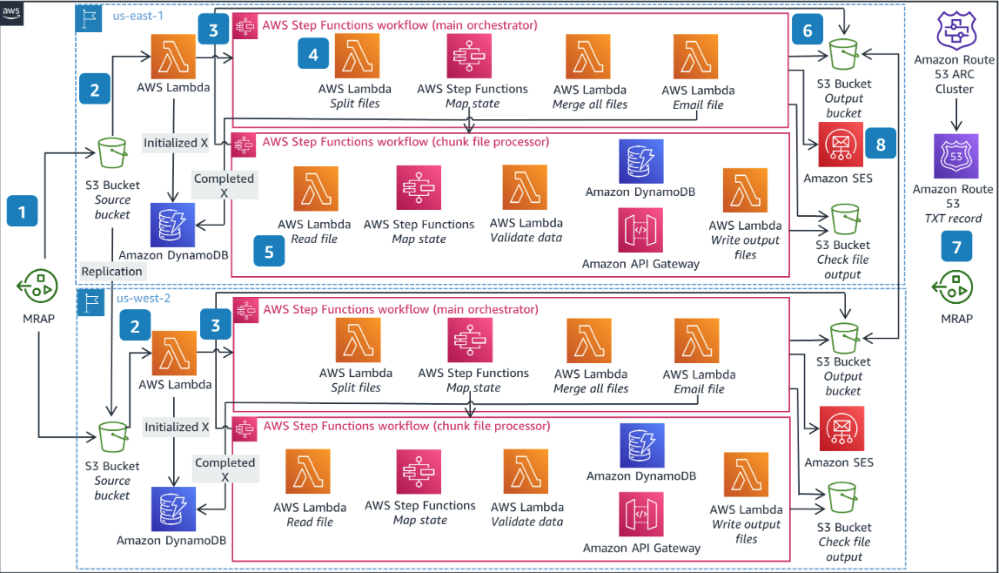
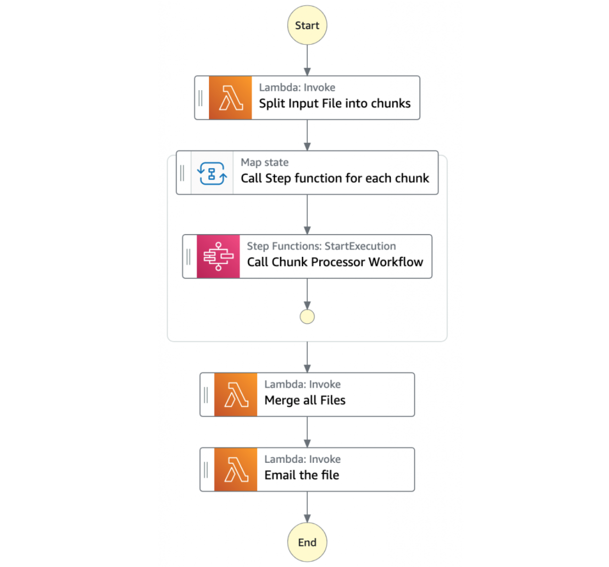
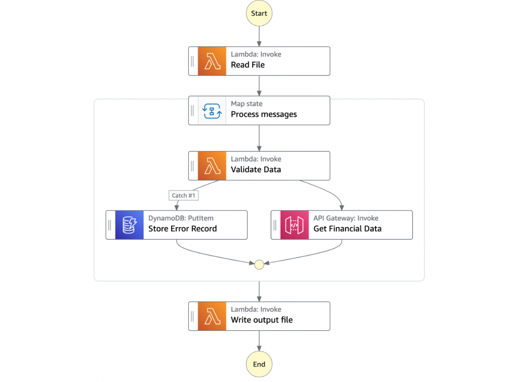
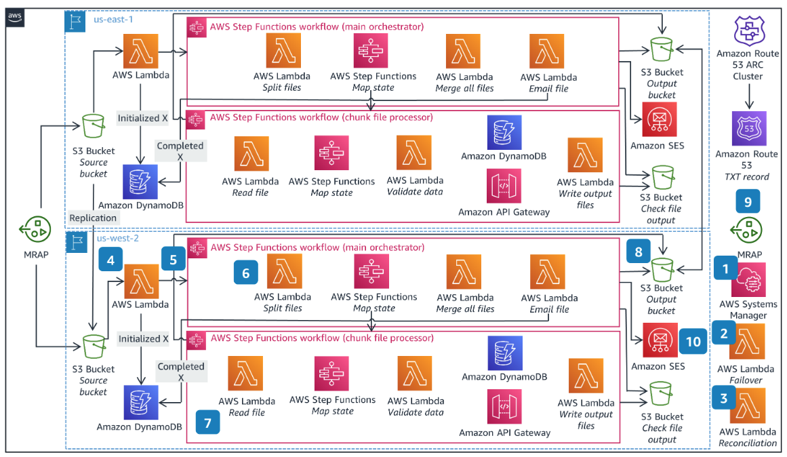
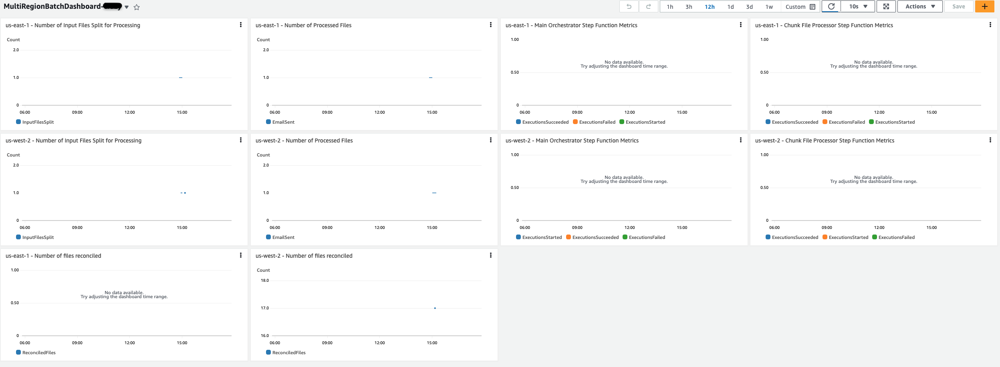

# Guidance for Multi-Region Serverless Batch Applications on AWS

## Getting started

This guidance helps customers design and operate a multi-Region, serverless batch solution on AWS using services like 
Step Functions, DynamoDB Global Tables, S3 Multi-Region Access Points, Route53 Application Recovery Controller and 
Lambda functions. The solution is deployed across two Regions that can failover and failback from one Region to another 
in an automated fashion. It leverages Amazon Route 53 Application Recovery Controller to help with the regional failover 
using AWS Systems Manager documents, S3 Multi-Region Access Points to provide a unified endpoint for S3 access that 
spans multiple Region, and DynamoDB Global Tables for persisting batch state and tracking.

## Architecture

### 1. Operating Batch in Primary Region

1. A file is put to S3 bucket via Multi-region Access Point.  MRAP routes the file to one of the S3 buckets.  Each bucket will replicate the object to the other bucket.
2. The lambda function is invoked via S3 putObject event in both regions.  
3. The function will resolve the TXT record in the Route53 private hosted zone to determine if it is the active region.  If it is, execution will continue.  If it is not, the function will exit and no further actions will be taken.  The function in the active region writes metadata on the file to the DynamoDB Batch State table including that the processing has started and starts the first Step Function.
4. The first Step Function (Main Orchestrator) orchestrates the processing of the file. 
    1. The first task state Split Input File into chunks calls a Lambda function. It splits the main file into multiple chunks based on the number of records and stores each chunk into an S3 bucket.
    2. The next state is a map state called Call Step Functions for each chunk. It uses the Step Functions service integration to trigger the Chunk Processor workflow for each chunk of the file. It also passes the S3 bucket path of the split file chunk as a parameter to the Chunk Processor workflow. Then the Main batch orchestrator waits for all the child workflow executions to complete.
    3. Once all the child workflows are processed successfully, the next task state is Merge all Files. This combines all the processed chunks into a single file and then stores the file back to the S3 bucket.
    4. The next task state Email the file takes the output file. It generates an S3 presigned URL for the file using the MRAP endpoint, and sends an email with the S3 MRAP presigned URL.
5. The next Step Function (Chunk File Processor) is responsible for processing each row from the chunk file that was passed. 
    1. The first task state Read reads the chunked file from S3 and converts it to an array of JSON objects. Each JSON object represents a row in the chunk file.
    2. The next state is a map state called Process messages. It runs a set of steps for each element of an input array. The input to the map state is an array of JSON objects passed by the previous task.
    3. Within the map state, Validate Data is the first state. It invokes a Lambda function that validates each JSON object using the rules that you have created. 
    4. Records that fail validation are stored in an Amazon DynamoDB table. 
    5. The next state Get Financial Data invokes Amazon API Gateway endpoints to enrich the data in the file with data from a DynamoDB table.
    6. When the map state iterations are complete, the Write output file state triggers a task. It calls a Lambda function, which converts the JSON data back to CSV and writes the output object to S3.
6. The merged file is written to S3 and bucket replication replicates it to the standby region's bucket.
7. A pre-signed URL is generated using the multi-region access point (MRAP) so that the file can be retrieved from either bucket (closest to the user) and the routing logic is abstracted from the client.
8. The pre-signed URL is mailed to the recipients so that they can retrieve the file from one of the S3 buckets via the multi-region access point.

### 2. Cross Region Failover and Failback

1. Systems Manager runbook is executed to initiate failover to standby region
2. The runbook invokes a Lambda function that connects to the Route53 Application Recovery Controller (ARC) cluster to toggle the TXT record in Route53 private hosted zone.
3. The runbook waits for 15 minute for S3 replication (since this solution enables the S3 Replication Time Control which has a SLA of 15 mins for replication) to finish and then invokes a second reconciliation Lambda function that reads the Batch State DynamoDB global table to determine the names of the objects to start processing but not complete.  The function then re-copies those objects within the standby bucket into the `input` directory.  It also logs any objects that were unfinished according to the DynamoDB table status but were not present in the S3 bucket in the standby region.
4. This creates the S3 putObject event and invokes the lambda function.
5. The function will resolve the TXT recored in the Route53 private hosted zone to determine if it is the active region.  Since the failover function in step 2 altered the TXT record, execution will continue. The function writes metadata on the file to the DynamoDB Batch State table including that the processing has started and starts the first Step Function.
6. The first Step Function (Main Orchestrator) orchestrates the processing of the file.
    1. The first task state Split Input File into chunks calls a Lambda function. It splits the main file into multiple chunks based on the number of records and stores each chunk into an S3 bucket.
    2. The next state is a map state called Call Step Functions for each chunk. It uses the Step Functions service integration to trigger the Chunk Processor workflow for each chunk of the file. It also passes the S3 bucket path of the split file chunk as a parameter to the Chunk Processor workflow. Then the Main batch orchestrator waits for all the child workflow executions to complete.
    3. Once all the child workflows are processed successfully, the next task state is Merge all Files. This combines all the processed chunks into a single file and then stores the file back to the S3 bucket.
    4. The next task state Email the file takes the output file. It generates an S3 presigned URL for the file using the MRAP endpoint, and sends an email with the S3 MRAP presigned URL.
7. The next Step Function (Chunk File Processor) is responsible for processing each row from the chunk file that was passed.
    1. The first task state Read reads the chunked file from S3 and converts it to an array of JSON objects. Each JSON object represents a row in the chunk file.
    2. The next state is a map state called Process messages. It runs a set of steps for each element of an input array. The input to the map state is an array of JSON objects passed by the previous task.
    3. Within the map state, Validate Data is the first state. It invokes a Lambda function that validates each JSON object using the rules that you have created. 
    4. Records that fail validation are stored in an Amazon DynamoDB table. 
    5. The next state Get Financial Data invokes Amazon API Gateway endpoints to enrich the data in the file with data from a DynamoDB table.
    6. When the map state iterations are complete, the Write output file state triggers a task. It calls a Lambda function, which converts the JSON data back to CSV and writes the output object to S3.
8. The merged file is written to S3 and bucket replication replicates it to the standby region's bucket.
9. A pre-signed URL is generated using the multi-region access point (MRAP) so that the file can be retrieved from either bucket (closest to the user) and the routing logic is abstracted from the client.
10. The pre-signed URL is mailed to the recipients so that they can retrieve the file from one of the S3 buckets via the multi-region access point.

## Pre-requisites

* To deploy this example guidance, you need an AWS account (We suggest using a temporary or a development account to 
  test this guidance), and a user identity with access to the following services:
    * AWS CloudFormation
    * Amazon API Gateway
    * Amazon CloudWatch
    * Amazon DynamoDB
    * AWS Step Functions
    * AWS Lambda
    * Amazon Simple Storage Service
    * Amazon Route 53
    * Amazon Virtual Private Cloud (VPC)
    * AWS Identity and Access Management (IAM)
    * AWS Secrets Manager
    * AWS Systems Manager
    * Amazon Simple Email Service
* Install the latest version of AWS CLI v2 on your machine, including configuring the CLI for a specific account and region
profile.  Please follow the [AWS CLI setup instructions](https://github.com/aws/aws-cli).  Make sure you have a 
default profile set up; you may need to run `aws configure` if you have never set up the CLI before. 
* Install Python version 3.9 on your machine. Please follow the [Download and Install Python](https://www.python.org/downloads/) instructions.
* Install the latest version of AWS SAM CLI on your machine. Please follow the [Install AWS SAM CLI](https://docs.aws.amazon.com/serverless-application-model/latest/developerguide/install-sam-cli.html)
* Install `make` for your OS if it is not already there. 

### Regions

This demonstration by default uses `us-east-1` as the primary region and `us-west-2` as the backup region. These can be changed in the Makefile

## Deployment

For the purposes of this workshop, we deploy the CloudFormation Templates and SAM Templates via a Makefile. For a production 
workload, you'd want to have an automated deployment pipeline.  As discussed in this 
[article](https://aws.amazon.com/builders-library/automating-safe-hands-off-deployments/?did=ba_card&trk=ba_card), a 
multi-region pipeline should follow a staggered deployment schedule to reduce the blast radius of a bad deployment.  
Take particular care with changes that introduce possibly backwards-incompatible changes like schema modifications, 
and make use of schema versioning.

## Configuration
Before starting deployment process please update the following variables in the `deployment/Makefile`:

**ENV** - It is the unique variable that indicates the environment name. Global resources created, such as S3 buckets, use this name. (ex: -dev)

**SES_IDENTITY** - The email id used to create a verified SES identity for sending emails. (ex: joejane@xyz.com). The solution creates a 
new identity in the Amazon Simple Email Service which requires a verification before it can be used by the solution. You can also provide an email address with the `+` symbol (for example; joejane+batch@xyz.com).

**PRIMARY_REGION** - The AWS region that will serve as primary for the workload

**SECONDARY_REGION** - The AWS region that will serve as standby or failover for the workload

## Deployment Steps

We use make file to automate the deployment commands. The make file is optimized for Mac. If you plan to deploy the solution from another OS, you may have to update few commands.

1. Deploy the full solution from the `deployment` folder
    ```shell
    make deploy
    ```
   
2. Check the Inbox of the SES Identity user email, for two emails asking you the click the verification links contained within. Please click on those links.

Once the above steps have completed, we should have all the key components of the workload deployed in the primary and standby region as specified in the architecture.  Expect the total deployment to take several minutes as it is orchestrating a deployment in two AWS regions in the proper order.

## Verify the deployment

1. Find the S3 Multi-Region Access Point(MRAP) ARN using the AWS Console or follow the below steps to construct the ARN.

    a. Export the AWS_ACCOUNT and the Multi Region Access Point name as created by the CloudFormation stack. The default MRAP name as configured, 
       follows the convention `source-bucket-mrap${ENV}` where the value of ENV is the same as was set in the Makefile.

   ```shell
       export AWS_ACCOUNT=xxxx
       export MRAP_NAME=source-bucket-mrap${ENV}
   ```
    b. To get the S3 MRAP Alias you can use the below command
   ```shell
       export MRAP_ALIAS=$(aws s3control get-multi-region-access-point --account-id ${AWS_ACCOUNT} --name ${MRAP_NAME} --region us-west-2 --output=text --query='{Alias: AccessPoint.Alias}')
   ```
   
2. From the `assets` folder, upload the [testfile.csv](assets/testfile.csv) to the Access Point identified in Step 1.
    ```shell
    aws s3 cp testfile.csv s3://arn:aws:s3::${AWS_ACCOUNT}:accesspoint/${MRAP_ALIAS}/input/testfile.csv
    ```
3. Depending on the Region that is primary, the file would be processed in that Region and you should receive an email in the inbox of the user belonging to the `SES_IDENTITY` that was provided initially. The email should contain a PreSigned URL to the processed output of the batch.  Since this URL was generated using the S3 Multi-region access point, the file will be retrieved from either available bucket.

## Load Testing

To simulate load by uploading a large number of files to S3 you can execute a simple shell script like the example shown in [assets/load-test.sh](assets/load-test.sh)
The script is automated to upload 100 objects to the MRAP endpoint with a 1 second delay in between consecutive uploads.

Execute the shell script as follows. To make the shell script as an executable you can use the command `chmod +x load_test.sh`
```shell
./load-test.sh $AWS_ACCOUNT $MRAP_ALIAS
```

## Observability

The deployment also provisions a Cloudwatch dashboard by the name of `MultiRegionBatchDashboard${ENV}` (where ENV is the same value that was set before the deployment), 
which display the following graphs



__For each Region (Primary and Standby)__
  * Number of input files split for processing
  * Number of Processed files
  * Main Orchestrator Step Function Metrics
    * Executions succeeded
    * Executions started
    * Executions failed
  * Chunk File Processor Step Function Metrics
    * Executions succeeded
    * Executions started
    * Executions failed
  * Number of files reconciled

## Injecting Chaos to simulate failures

To induce failures into your environment, you can use the [fisTemplate.yml](deployment/fisTemplate.yml) and perform Chaos experiments.
This cloudformation template uses AWS Fault Injection Simulator to simulate failures like blocking network access to S3 Buckets/DynamoDB from the subnets for a specific duration.
Running this experiment will allow you to perform a Regional failover and observe the reconciliation process. 

To deploy the Chaos testing resources in both the Regions - Primary and Standby, you can execute the below command.
```shell
make chaos
```

The following sequence of steps can be used to test this solution.
1. The first step is to get the experimentTemplateId to use in our experiment; use the below command for that and make a note of the `id` value
   ```shell
   export templateId=$(aws fis list-experiment-templates --query='experimentTemplates[?tags.Name==`MultiRegionBatchChaosTemplate`].{id: id}' --output text)
   ```
2. Execute the experiment in the primary Region using the following command using the templateId from the previous step.
   ```shell
   aws fis start-experiment --experiment-template-id $templateId
   ```
For more details on the specific FIS network action used in this template, read this [documentation](https://docs.aws.amazon.com/fis/latest/userguide/fis-actions-reference.html#disrupt-connectivity)

## Executing SSM Failover Automation in Standby Region

To trigger a Regional failover of the batch process, execute the SSM Automation from the standby Region as follows.

```shell
export SECONDARY_REGION=us-west-2
aws ssm start-automation-execution --document-name "AutomationFailoverRunbook" --document-version "\$DEFAULT" --region $SECONDARY_REGION
```

## Cleanup

1. Delete all the cloudformation stacks and associated resources from both the Regions, by running the following command from the `deployment` folder
    ```shell
    make destroy-all
    ```
   
2. if you have deployed the Chaos testing stack, you can delete the cloudformation stacks using the following command
    ```shell
    make destroy-chaos
    ```

## Security
See [CONTRIBUTING](CONTRIBUTING.md) for more information.

## License
This library is licensed under the MIT-0 License. See the [LICENSE](LICENSE) file.